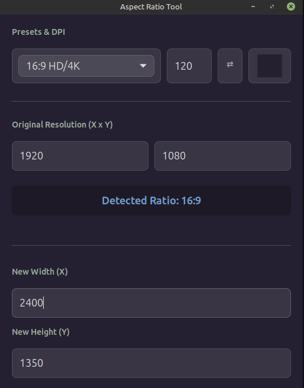

# ARP - Aspect Ratio Tool

A simple and powerful tool for calculating aspect ratios and pixel dimensions for design, print, and social media.



## Features
- **Ratio Detection**: Automatically identifies the ratio (e.g., 16:9, 4:3, 21:9) from any resolution.
- **Aspect Ratio Presets**: Large list of common formats:
  - **Print**: A4, A3, Letter, Legal
  - **Photo**: 4x6, 5x7, 8x10, 11x14
  - **Film/Digital**: 16:9 HD/4K, 4:3, 21:9 Ultrawide, Cinema (1.85:1), Anamorphic (2.39:1)
  - **Social Media**: Instagram Square/Portrait, TikTok/Reels, Social Banners
- **DPI-based Calculation**: Define a DPI to automatically calculate pixel counts based on physical dimensions.
- **Orientation Toggle**: Instantly swap width and height with a single click (⇄).
- **Dynamic Theme Color Picker**: Customize the app's background color with automatic text contrast adjustment.
  - Light backgrounds automatically switch to dark text
  - Dark backgrounds automatically switch to light text
  - Uses brightness calculation: `Y = 0.299*R + 0.587*G + 0.114*B`

## Installation

### Prerequisites
- Python 3
- GTK+ 3
- PyGObject

### Dependencies (Linux/Ubuntu)
```bash
sudo apt update
sudo apt install python3-gi python3-gi-cairo gir1.2-gtk-3.0
```

### Running the App
```bash
python3 aspect_tool.py
```

## License
This project is licensed under the MIT License - see the [LICENSE](LICENSE) file for details.
